# PricePoint Dynamics: UK Supermarket Competitive Intelligence
Live Dashboard: https://pricepointdynamics.streamlit.app/

# 📖 Executive Summary
PricePoint Dynamics is an end-to-end data science initiative designed to decode the pricing strategies of the "Big 5" UK supermarkets: **Tesco, Sainsbury's, ASDA, Morrisons, and Aldi**

Moving beyond basic web scraping, this project employs advanced Natural Language Processing (NLP) to solve the "product matching problem", creating a unified view of the market. It utilizes Gradient Boosting (LightGBM) to forecast daily prices with high precision $(MAE: £0.14)$ and leverages Explainable AI (SHAP) to deconstruct the drivers of price volatility.

This repository demonstrates a full-lifecycle ML workflow: data engineering at scale ($~9.5M$ records), semantic similarity search, predictive modeling, anomaly detection, and the deployment of an interactive stakeholder dashboard.


# 🏗️ Architecture & Workflow
The system follows a modular architecture designed for scalability and reproducibility.



This section explains the three zone architecture shown in the Mermaid, detailing how data flows from raw CSVs to an interactive dashboard.

### ZONE 1: The Offline Data Factory
**Where raw retailer data becomes analysis-ready**

#### Problem: Product Matching Across Retailers
When you scrape product data from 5 different supermarkets, you get chaos:

- Tesco: `"Tesco Finest Bananas 5pk"`
- Aldi: `"Aldi Bananas 5 Pack"`
- ASDA: `"ASDA Growers Selection Bananas x5"`

These are the same product, but standard string matching fails.  
Simple fuzzy matching would require comparing every product against every other product: $127{,}000 \times 127{,}000 \approx 1.61 \times 10^{10}$ comparisons, which is extremely high.

#### Solution: Semantic Product Matching Pipeline

**Step 1: Text Normalization**

Removes units, punctuation, and retailer brand names to focus on the core product identity.

```bash
Input: "Tesco Finest Bananas 5pk - 1.2kg"
Output: "finest bananas"
```
**Step 2: Sentence-BERT Embeddings**

Converts product names into $768$-dimensional vectors that capture semantic meaning:

- `"bananas 5 pack"` and `"5pk bananas"` → nearly identical vectors
- `"chocolate biscuits"` → completely different vector

**Step 3: FAISS Similarity Search**

Instead of comparing all products pairwise (O(N²)), FAISS builds an index that enables:

- Fast lookup: Find similar products in milliseconds (log-linear time)
- Scalable matching: Handle $127,000+$ products efficiently

**Output: `canonical_products_e5.parquet`**

- $67,000+$ matched products (up from $3,000$ with simple text matching)
- $9.5$ million price records with unified canonical IDs

Now you can compare "apples to apples" across all retailers.

#### Feature Engineering: Building Predictive Power

Raw prices alone aren't enough. Context is needed:

**Temporal Features**  

- Yesterday's price  
- 7-day rolling average  
- Lowest price in the past week  
- Price change from yesterday  

**Competitive Features**  

- Price vs. market average  
- Price rank among retailers (1 = cheapest, 5 = most expensive)  

**Storage Format: Parquet (columnar, compressed)**  

- Reads 10–100x faster than CSV  
- Allows loading only required columns  
- ~$200MB$ compressed vs. 2GB+ as CSV  

---

### ZONE 2: The ML Model Factory
**Where features become predictions and insights**

#### Model Training: LightGBM Regressor

**Why LightGBM over XGBoost or Neural Networks?**

- Speed: Trains on $4.9M$ samples in minutes  
- Native categorical handling: Directly processes supermarket and category  
- Robustness: Less prone to overfitting on tabular data  

**Why MAE (Mean Absolute Error) instead of MSE?**

- Retail data has extreme outliers (scraping errors like $£0.01$ or $£999.99$)  
- MSE squares errors, making the model chase outliers  
- MAE is interpretable: "On average, we're off by 14 pence"

**Performance**

- Training set: $4.9M$ records  
- Test set: $460K$ records (final week)  
- MAE: $£0.14$ (median product price: $£1.80$)

#### Pre-computation Strategy: Build-Time vs. Runtime

**Problem:** Some analyses are too expensive to run in real-time:

- SHAP explanations for $8,000$ samples take 5–10 minutes  
- Cross-correlation: $67K$ products × 5 retailers

**Solution:** Compute once, serve infinitely

**Build-Time Process (Runs locally, once)**

- Load trained model  
- Sample $8,000$ representative products  
- Calculate SHAP values ($10$ minutes)  
- Save as compressed NumPy array ($50MB$)

**Runtime Performance (Dashboard)**

- Load pre-computed SHAP values in $200ms$  
- Page loads in $<1$ second  

**Artifacts Generated**

- `shap_values.npy`: Feature importance for $8,000$ predictions  
- `market_dispersion.parquet`: Daily price variation across retailers  
- `price_leadership.parquet`: Cross-correlation showing price leaders  

---

### ZONE 3: The Streamlit Serving Layer
**Where data becomes interactive insights**

#### Caching Strategy: Load Once, Use Forever

- Streamlit caching decorators load data once per session  
- Data stored in RAM for instant access

**Memory Optimization**

- Load only required columns  
- Convert to efficient data types (`category` instead of `object`, `float32` instead of `float64`)  
- $9.5M$ row dataset loads in 2–3 seconds, uses $<500MB$ RAM

#### Dashboard Pages: From Data to Decisions

**Page 1: Market Overview**  

- Visualizes price distributions and portfolio sizes  
- Insights: Aldi is cheapest, Sainsbury's has most variety

**Page 2: Basket Analysis**  

- Compares standardized shopping baskets across retailers  
- Uses product matching for "like-for-like" comparison  
- Insights: Morrisons beats Aldi on "Free From" basket

**Page 3: Price Predictor**  

- Real-time inference: User selects features → model predicts price instantly  
- Online inference in $<100ms$

**Page 4: Model Insights**  

- Loads pre-computed SHAP values  
- Shows global feature importance and individual explanations  
- No computation required

**Page 5: Market Dynamics**  

- Loads pre-computed market dispersion and price leadership data  
- Interactive network graph showing price leaders/followers  
- Insights: Tesco leads, Sainsbury's follows with ~2-week lag

## Key Artifacts Summary

The entire system is defined by these synchronized outputs:

| Artifact | Size | Purpose | Generated By |
|----------|------|---------|--------------|
| `canonical_products_e5.parquet` | 200MB | Matched product database | ZONE 1 (Semantic ETL) |
| `feature_engineered_data.parquet` | 180MB | Training data with temporal features | ZONE 1 (Feature engineering) |
| `price_predictor_lgbm.joblib` | 25MB | Trained ML model | ZONE 2 (Model training) |
| `shap_values.npy` | 50MB | Pre-computed feature importance | ZONE 2 (Batch job) |
| `market_dispersion.parquet` | 2MB | Daily price variation metrics | ZONE 2 (Batch job) |
| `price_leadership.parquet` | 1MB | Cross-correlation results | ZONE 2 (Batch job) |

**Critical Workflow:** 
```bash
Monthly refresh rebuilds Zone 1 → triggers Zone 2 model retraining → updates all artifacts → deploy to Zone 3
```
# 🔬 Technical Methodology
## 1. Data Engineering & validation
**Source:** [Kaggle UK Supermarket Data](https://www.kaggle.com/datasets/declanmcalinden/time-series-uk-supermarket-data)  

- **Scope:** Processed daily pricing data from five major UK retailers.
- **Volume:** Handled over 9.5 million transaction records.
- **Validation:** Applied rigorous quality checks to detect and correct scraping artifacts.
- **Unit Standardization:** Corrected unit-price discrepancies (e.g., `£/100g` vs `£/kg`), which previously caused outliers up to `£99k/kg`. 
- **Sanitization:** Normalized text fields and standardized `own_brand` flags for downstream NLP and analytical workflows.  

## 2. The "Apples-to-Apples" Problem (NLP)
A major challenge in retail analytics is comparing "Tesco Bananas 5pk" with "Aldi Natures Pick Bananas 5pk". Exact string matching fails here.
- **Solution:** Implemented a semantic search pipeline using **Sentence-BERT** (`intfloat/e5-large`)
- **Vector Database:** Utilized **FAISS** (Facebook AI Similarity Search) to map retailer-specific SKUs to a "Canonical Product" representation.
- **Result:** Enabled true like-for-like comparison across retailers, forming the backbone of the market basket analysis.

## 3. Feature Engineering Strategy
To predict future prices, the model requires context beyond the current price. We engineered a robust feature set (32+ dimensions):
- **Temporal Dynamics:** 7, 14, and 30 day rolling means, standard deviations, mins and maxes.
- **Momentum Signals:** Price lags (t-1, t-7) and daily velocity (1st order differencing).
- **Competitive Context:** Crucial relative metrics calculated daily, such as `price_vs_market_avg` and `is_cheapest_in_market`.
- **Cyclical Encodings:** Day of week, day of month, and week of year embeddings.

## 4. Predictive Modeling
- **Algorithm LightGBM Regressor** (Gradient Boosting Decision Tree). Chosen for its speed, handling of categorical variables, and performance on tabular time series data.
- **Objective:** L1 Loss (Mean Absolute Error)  to reduce sensitivity to extreme outliers compared to RMSE.
- **Training Strategy:** Time-series cross-validation (training on past, testing on future) to prevent data leakage.
- **Performance Metrics:**
    * **MAE:** $£0.1390$ (Average prediction error is just $14$ pence).
    * **RMSE:** $£0.3728$.
    * **R² Context:** The standard deviation of prices is $£7.01$. An error of $£0.14$ represents a $~2\%$ relative error, indicating extremely high predictive power.

## 5. Unsupervised Anomaly Detection
Deployed an Isolation Forest model to scan for pricing irregularities.
- **Findings:** Identified $~95,000$ anomalous pricing events ($1\%$ contamination rate).
- **Insight:** Detected "oscillation patterns" where products flipped prices daily (e.g., £23 $\leftrightarrow$ £12). This suggests algorithmic A/B testing by retailers or scraping inconsistencies.

# 📊 Key Findings & Market Insights
## 1. Market Positioning Matrix
Data analysis confirms a two tier market structure:
- **The Budget Anchor: Aldi** consistently defines the price floor. The model's SHAP values show that the `supermarket=Aldi` feature systematically pushes price predictions downward.
- **The Mainstream Battleground: Tesco** & **Sainsbury's** operate in near lock-step.
- **The Value challanger: Morrisons** has carved a niche, beating Aldi on specific categories like "Healthy Choice" and "Free From" baskets.

## 2. Leader-Follower Dynamics
Cross-correlation analysis reveals a temporal dependency in pricing updates:
- **Tesco** acts as the primary price leader, initiating changes.
- **Sainsbury's** typically reacts with a lag of approximately 14 days, validating the "follower" hypothesis.

## 3. Price Inertia and Drivers
SHAP (SHapley Additive exPlanations) analysis reveals the model's decision hierarchy:
- **Price History is King:** The 7-day minimum price (`price_rol_min_7d`) is the single strongest predictor. Prices exhibit high inertia.
- **Market Relativity:** A product's deviation from the daily market average is a top-3 predictor, proving that retailers price dynamically based on competitors.
- **Brand Premium:** The `own_brand` flag significantly impacts price sensitivity.

# 💻 Dashboard & Usage
The Streamlit dashboard allows non-technical stakeholders to interact with the models.

Navigation Guide
1. **Market Overview:** High-level KPIs, total basket costs, and inflation tracking across the 5 retailers.

2. **Basket Analysis:** Select a specific "Lifestyle Basket" (e.g., Student, Family, Luxury) to see which retailer wins for that specific demographic.

3. **Price Predictor:** Select a product and retailer to generate a real-time price forecast for the next 7 days using the trained LightGBM model.

4. **Model Insights:** Interactive SHAP plots explaining why the model predicted a specific price.

5. **Market Dynamics:** Visualizations of price dispersion and volatility over time.


# 📂 Project Structure

```bash
├── .devcontainer/       # Dev container configuration
├── .streamlit/          # Streamlit theme & config
├── dashboard/           # Dashboard Application Code
│   ├── app.py           # Main entry point
│   ├── data_loader.py   # Cached data loading utilities
│   └── pages/           # Individual dashboard pages
├── notebooks/           # Jupyter Notebooks for Experimentation
│   ├── 01_data_ingestion.ipynb       # Cleaning & Validation
│   ├── 03_product_matching.ipynb     # S-BERT & FAISS pipeline
│   ├── 05_feature_engineering.ipynb  # Rolling stats & Lag generation
│   ├── 06_model_training.ipynb       # LightGBM & Evaluation
│   └── 07_anomaly_detection.ipynb    # Isolation Forest
├── src/                 # Shared python modules
├── requirements.txt     # Python dependencies
└── README.md            # Project documentation
```

# ⚙️ Installation
To reproduce this analysis or run the dashboard locally:

1. Clone the repository:
```bash
git clone https://github.com/bhargavkumarnath/pricepoint-dynamics.git
cd pricepoint-dynamics
```

2. Set up environment
```bash
python -m venv venv
source venv/bin/activate  # On Windows use `venv\Scripts\activate`
pip install -r dashboard/requirements.txt
```
3. Run the Dashboard:

```bash
streamlit run dashboard/app.py
```

# 📜 License
This project is licensed under the MIT License - see the LICENSE file for details.

Author: Bhargav Kumar Nath

Data Science | ML Engineering | Strategy