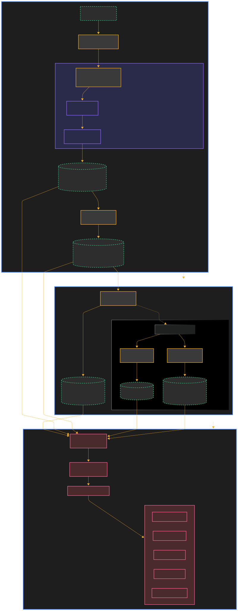

# PricePoint Dynamics: UK Supermarket Competitive Intelligence

[](https://pricepointdynamics.streamlit.app/)
[](https://www.python.org/downloads/)
[](https://github.com/astral-sh/ruff)

## 📖 Executive Summary
PricePoint Dynamics is an end-to-end Machine Learning pipeline and analytics engine designed to decode the pricing strategies of the "Big 5" UK supermarkets: **Tesco, Sainsbury's, ASDA, Morrisons, and Aldi**.

Moving beyond basic web scraping, this project employs advanced Natural Language Processing (NLP) to solve the complex "product matching problem" across competing retailers. It utilizes Gradient Boosting (`LightGBM`) to forecast daily prices with high precision (MAE: £0.14) and leverages Explainable AI (`SHAP`) to deconstruct the drivers of price volatility.

Originally prototyped in notebooks, this repository has been thoroughly refactored into a **robust, production-ready Python package**. It features a configuration-driven architecture, rigorous data validation (`Pandera`), a command-line interface (`Typer`), and an automated CI/CD pipeline.

---

## 🏗️ System Architecture



The system is decoupled into two primary environments: the **Core ML Pipeline** (for heavy data processing) and the **Serving Layer** (interactive dashboard).

### 1. The Core ML Pipeline (`pricepoint/`)
A modular Python package executed via the `run.py` CLI. It manages the entire data lifecycle for 9.5 million transaction records:

*   **Ingestion & Validation**: Raw CSVs are ingested, sanitized, and strictly validated against Pandas schemas.
*   **Semantic Matching**: Uses **Sentence-BERT** (`intfloat/e5-large`) and **FAISS** to map retailer-specific SKUs (e.g., "Tesco Finest Bananas 5pk") to a canonical identity, enabling true "apples-to-apples" grouping.
*   **Feature Engineering**: Generates 32+ temporal, momentum, and competitive features (e.g., 7-day rolling minimums, price rank vs market average) stored efficiently in Parquet format.
*   **Predictive Modeling**: Trains a `LightGBM` regressor using time-series cross-validation to predict future prices.
*   **Market Dynamics & SHAP**: Pre-computes computationally expensive metrics—like the Herfindahl-Hirschman Index (HHI), cross-correlation price leadership, and SHAP value matrices—for instant retrieval.

### 2. The Serving Layer (`dashboard/`)
A Streamlit application that consumes the artifacts generated by the core pipeline. It is optimized for sub-second page loads and minimal memory footprint using PyArrow backend data structures and Streamlit caching.

---

## ☁️ Live Deployment & Limitations

**Live Dashboard:** [https://pricepointdynamics.streamlit.app/](https://pricepointdynamics.streamlit.app/)

The public dashboard is hosted on Streamlit Cloud, which imposes a strict **1 GB RAM limit**. 

To prevent Out-Of-Memory (OOM) crashes while serving 9.5 million rows, the live deployment uses a synchronized **Lite Architecture**:
*   **The Constraint:** The full `canonical_products` dataset is 722 MB on disk and consumes >1.5 GB when loaded into Pandas memory natively.
*   **The Lite Dataset:** We use a temporally sampled lightweight dataset (`canonical_products_lite.parquet` - 42 MB). 
*   **Impact:** The lite dataset preserves **all 78,000+ unique products** and all 5 supermarkets to ensure the Basket Analysis behaves perfectly. It simply samples the time-series points (every 4th day) to keep memory footprint safely under 150 MB using PyArrow.

*Note: For the highest resolution time-series tracking, you must run the full system locally.*

---

## 💻 Full System Usage (Running Locally)

To process the full 9.5 million row dataset and train the models yourself, follow these steps. *(Note: 8GB+ RAM recommended for the full pipeline).*

### 1. Setup Environment
```bash
# Clone the repository
git clone https://github.com/bhargavkumarnath/pricepoint-dynamics.git
cd pricepoint-dynamics

# Create and activate a virtual environment
python -m venv .venv
source .venv/bin/activate  # On Windows: .venv\Scripts\activate

# Install core pipeline dependencies and development tools
pip install -r requirements.txt

# Install dashboard dependencies (Streamlit, UI tools)
pip install -r dashboard/requirements.txt
```

### 2. Run the ML Pipeline (CLI)
The entire pipeline is orchestrated via the `run.py` Typer CLI. All parameters and file paths are centralized in `config.yaml`.

Run the stages in sequential order:

```bash
# 1. Ingest, clean, and validate the raw CSV data
python run.py ingest

# 2. Run the NLP semantic product matching (FAISS)
python run.py match

# 3. Generate time-series and competitive features (Parquet creation)
python run.py features

# 4. Train the LightGBM price prediction model and evaluate MAE
python run.py train

# 5. Pre-compute SHAP values, HHI, and Price Leadership metrics
python run.py market

# 6. Run the Isolation Forest anomaly detection
python run.py anomaly
```

### 3. Launch the Dashboard
Once the pipeline has generated the artifacts in the `data/02_processed/`, `models/`, and metric directories, launch the UI:

```bash
streamlit run dashboard/app.py
```

---

## 🔬 Technical Highlights

### Rigorous Software Engineering
*   **Config-Driven:** Zero hardcoded paths or hyper-parameters. Everything is controlled systematically via `config.yaml` using Pydantic validation.
*   **Data Contracts:** Leveraging `Pandera` to enforce strict schema definitions on incoming data batches, preventing silent failures.
*   **CI/CD Integration:** Automated unit testing (`pytest`) and linting (`ruff`) executed via GitHub Actions on every pull request.

### The "Apples-to-Apples" Problem (NLP)
Simple fuzzy matching fails across 127k products (requiring billions of comparisons). We utilized **Sentence-BERT** to extract 768-dimensional semantic vectors and **FAISS** for log-linear similarity searches. This expanded our match rate from 3,000 to over 67,000 identical cross-retailer products.

### Predictive Modeling & Interpretability
*   **Algorithm:** LightGBM Regressor. Selected for its native handling of categorical features and extreme training speed.
*   **Loss Function:** Optimized for Mean Absolute Error (MAE) rather than MSE to reduce extreme sensitivity to raw scraping outliers.
*   **Performance:** Achieved an MAE of **£0.14** (average prediction error of 14 pence) on a hold-out test set.
*   **Explainability:** Pre-computed SHAP matrices allow business users to instantly visualize whether "Competitor Pricing" or "Inertia" drove a specific algorithmic prediction.

---

## 📊 Key Findings & Market Insights

1.  **The Budget Anchor:** **Aldi** consistently defines the absolute price floor. SHAP analysis proves the `supermarket=Aldi` feature systematically depresses price predictions across all categories.
2.  **The Mainstream Lockstep:** **Tesco** and **Sainsbury's** operate in near-perfect parallel pricing. Time-series cross-correlation reveals Tesco acts as the standard price leader, with Sainsbury's typically matching price movements with a 14-day temporal lag.
3.  **The Predictors of Price:** Historical inertia (7-day rolling minimums) is the strongest predictor of tomorrow's price. However, deviation from the daily **Market Average** is a top-3 predictor, demonstrating that retailers algorithmically react to competitor signals rather than pricing in a vacuum.

---

## 📂 Project Structure

```text
pricepoint-dynamics/
├── .github/workflows/          # CI/CD pipelines (Pytest, Ruff)
├── dashboard/                  # Streamlit Web Application
│   ├── app.py                  # Streamlit Entrypoint
│   ├── data_loader.py          # PyArrow caching and artifact loading
│   └── pages/                  # Interactive modules (Basket Analysis, etc)
├── data/                       # Local data storage (Ignored in Git)
├── models/                     # Serialized LightGBM .joblib models
├── pricepoint/                 # Core Python Package
│   ├── config.py               # Pydantic Configuration loading
│   ├── schemas.py              # Pandera Data Validation
│   ├── data_ingestion.py       # Cleaning & Validation
│   ├── product_matching.py     # Sentence-BERT & FAISS
│   ├── feature_engineering.py  # Advanced feature synthesis
│   ├── training.py             # LightGBM pipeline
│   ├── anomaly.py              # Isolation Forest
│   └── market_analysis.py      # HHI & SHAP generation
├── tests/                      # Unit tests (Pytest)
├── run.py                      # Typer CLI orchestrator
├── config.yaml                 # Central project configuration
└── requirements.txt            # Package dependencies
```

---

*Author: Bhargav Kumar Nath*  
*Data Science | ML Engineering | Strategy*